# Your Content Assistant — User Guide

Hi! This bot is your personal social-media helper on Telegram. Her name is **Stella**.
She studies your Instagram, helps you come up with post ideas, and writes finished
**carousels** (the swipeable image posts) and **reels** (short video scripts) in your
own voice.

You don't need to know anything technical. You just tap buttons and answer simple
questions, and she does the heavy lifting.

> **A quick word on what you get**
> - **Carousels** come out as real, ready images you can post — and the bot can even
>   publish them straight to Instagram for you.
> - **Reels** come out as a written **script** — the hook, what to say or put on screen,
>   and a caption with hashtags. You film and edit the actual video yourself. (For now!)

**How to open the menu:** just type any message (like "hi") in the chat, and the menu
appears.

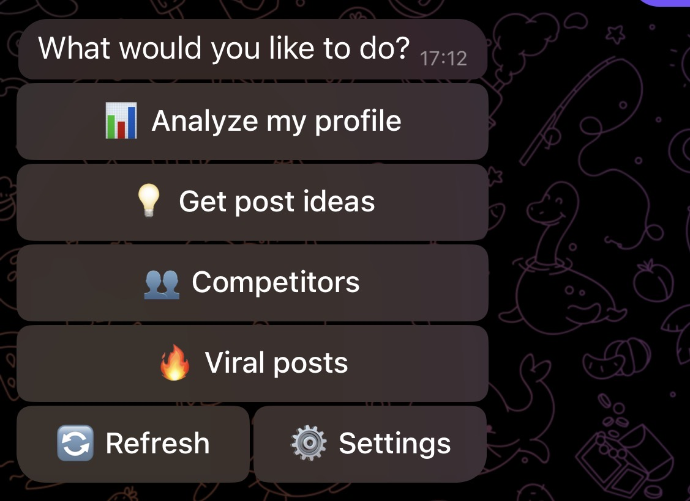

---

## Table of contents

1. [First-time setup](#1-first-time-setup)
2. [Analyze your profile (do this once first)](#2-analyze-your-profile-do-this-once-first)
3. [Come up with post ideas](#3-come-up-with-post-ideas)
4. [Make a carousel post](#4-make-a-carousel-post)
5. [Edit your carousel](#5-edit-your-carousel)
6. [Publish a carousel to Instagram](#6-publish-a-carousel-to-instagram)
7. [Make a reel](#7-make-a-reel)
8. [Turn a carousel into a reel](#8-turn-a-carousel-into-a-reel)
9. [Build your own reel format](#9-build-your-own-reel-format)
10. [Find trending content (Viral posts)](#10-find-trending-content-viral-posts)
11. [Track competitors](#11-track-competitors)
12. [Change your background or logo](#12-change-your-background-or-logo)
13. [Get a daily idea reminder](#13-get-a-daily-idea-reminder)
14. [Connect your Instagram account](#14-connect-your-instagram-account)

---

## 1. First-time setup

You only do this once.

1. Type **/start** in the chat.
2. Stella asks for your Instagram handle. Send it (for example `@yourname` or `yourname`).
3. She shows your profile picture and bio and asks **"Is this you?"** Tap **✅ Yes**.
   (If it's the wrong account, tap **❌ No** and send the right handle.)
4. She asks what you do. Write 2–3 sentences about your niche — who you help and how.
5. She shows a tidy summary of your niche and asks **"Is this right?"** Tap **✅ Yes**.

That's it — you're set up. 🎉

---

## 2. Analyze your profile (do this once first)

Before Stella can write anything for you, she needs to study your account once. This
teaches her your niche, your voice, your recurring themes, and what your audience
responds to.

1. Open the menu (type any message).
2. Tap **📊 Analyze my profile**.
3. Wait a moment. She sends back a summary of your account.

**Do this once right after setup.** After that, you can tap it again anytime you want a
fresh read — for example if your content has shifted, or every month or so. You don't
need to do it before every post.

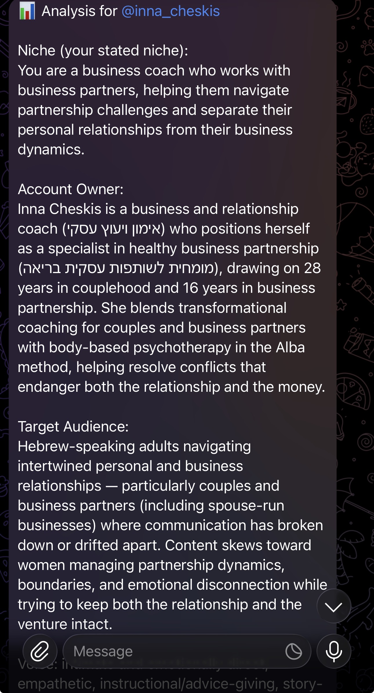

---

## 3. Come up with post ideas

Stella keeps a list of post ideas for you. You add to it, and later you pick from it
when making a carousel or reel.

1. Open the menu and tap **💡 Get post ideas**.
2. Tap **💭 Brainstorm**.
3. You'll see your current ideas, plus these choices:
   - **➕ Brainstorm new ideas** — get fresh ideas.
   - **🗑️ Remove topic** — delete one idea.
   - **⚠️ Remove all** — clear the whole list (asks you to confirm first).

### Get fresh ideas

After tapping **➕ Brainstorm new ideas**, you choose how:

- **🤖 Auto-generate from profile** — Stella invents a batch of new ideas based on your
  niche and what works on your account. Great when you're staring at a blank page.
- **✍️ Write my own idea** — you type one idea yourself.

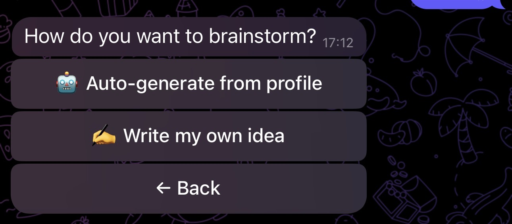

### When you write your own idea

1. Tap **✍️ Write my own idea** and type your idea (a short line, 5–15 words).
2. Choose what to do with it:
   - **💾 Keep idea as-is** — saves exactly what you typed.
   - **🌱 Expand to many** — Stella turns your one idea into a batch of related ideas.

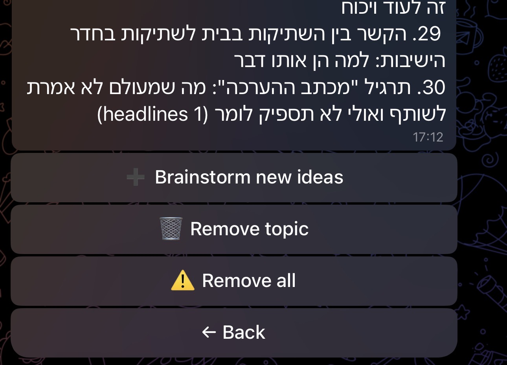

---

## 4. Make a carousel post

A carousel is the swipeable, multi-image Instagram post.

1. Open the menu and tap **💡 Get post ideas**.
2. Tap **📜 Carousel post**.
3. Pick an idea by tapping its number.
4. Choose your hook (the opening line):
   - **🤖 Generate with AI** — Stella offers several hook options; tap the number of the
     one you like. Not feeling them? Tap **🔄 Regenerate headlines** for a fresh set.
   - **✍️ Write your own** — type your own hook and it's used exactly as written.
5. Stella writes the full carousel text and shows it to you.
6. Tap **🎨 Generate images** to turn the text into real images.
7. She sends back your finished carousel as a single preview sheet.

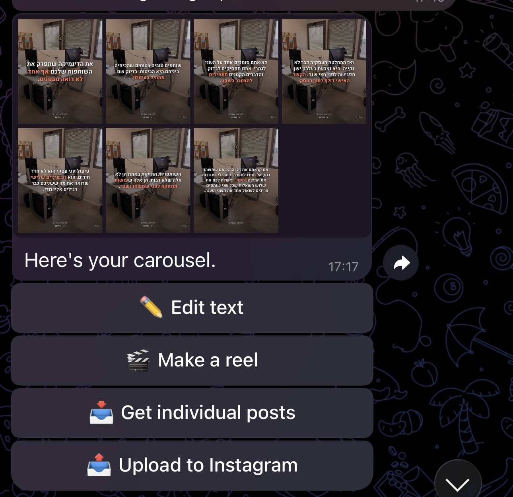

From here you can edit it, get the images, turn it into a reel, or publish it — see the
next sections.

> **Tip:** To get each slide as its own image (for posting manually), tap
> **📥 Get individual posts**. Stella sends every slide as a separate photo.

---

## 5. Edit your carousel

Right under the carousel preview, you have editing tools.

### Change a slide's words

1. Tap **✏️ Edit text**.
2. Tap the slide you want to change (**Slide 1**, **Slide 2**, …).
3. Stella shows the current text in a copyable box. Tap it to copy, fix the words, and
   send it back.
4. She re-makes the images with your change.

> **About the stars:** You'll see some words wrapped in `*stars*`. Those words get
> **highlighted** in the image. Keep the stars, move them, or add them around other
> words to control what stands out.

### Add a slide

1. Tap **✏️ Edit text**, then **➕ Add slide**.
2. Choose where it goes (at the start, after a certain slide, or at the end).
3. Stella adds a placeholder slide and asks for its text — type it and send it back.

### Remove a slide

1. Tap **✏️ Edit text**, then **➖ Remove slide**.
2. Tap the slide to remove. (A carousel always keeps at least 2 slides.)

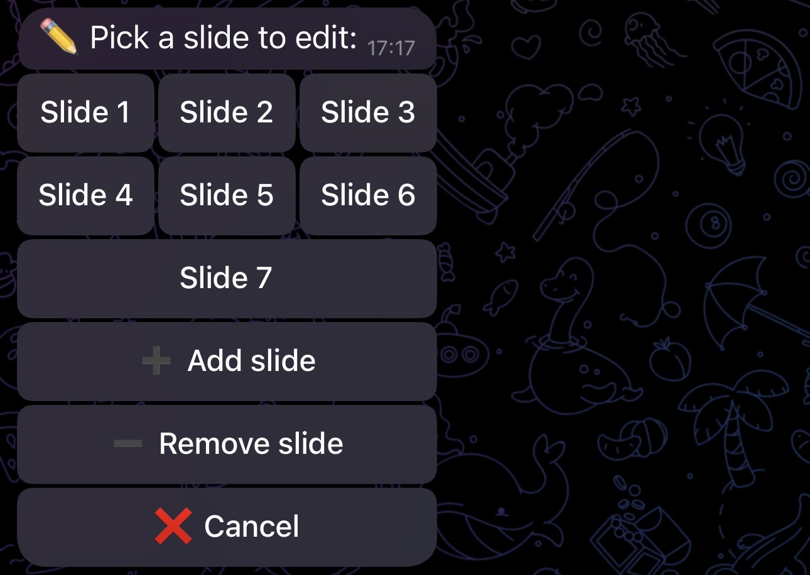

---

## 6. Publish a carousel to Instagram

You can post your carousel straight to Instagram from the bot. (You need to connect
Instagram first — see [section 14](#14-connect-your-instagram-account).)

1. Under your carousel preview, tap **📤 Upload to Instagram**.
2. Stella shows a preview of how the post will look, with your caption and hashtags.
3. If it looks good, tap **✅ Looks good, publish**.
4. She posts it and sends you the link. Done!

To stop, tap **❌ Cancel** — nothing gets posted.

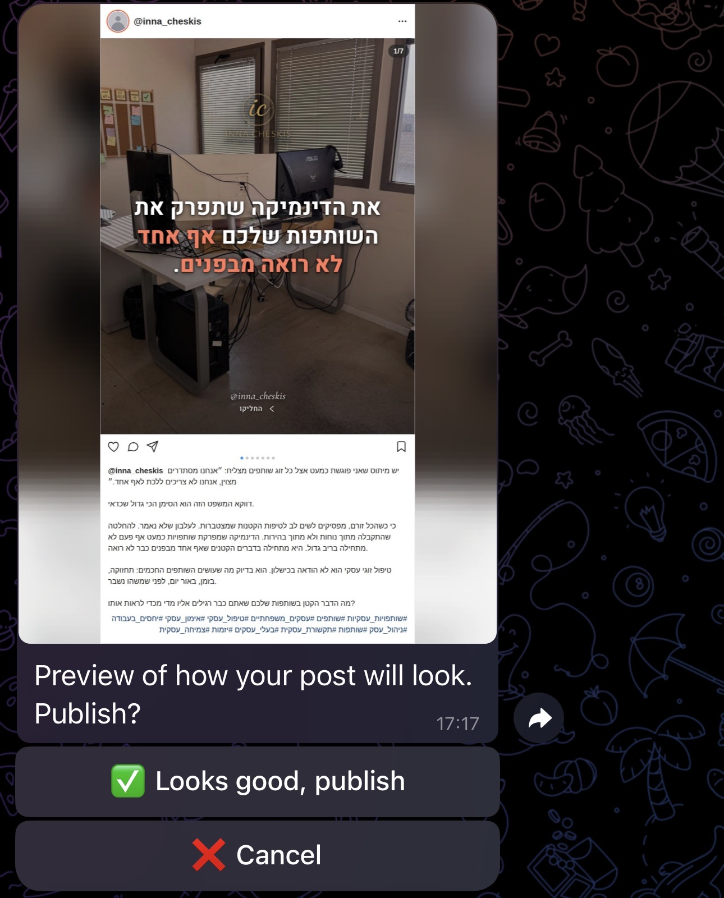

---

## 7. Make a reel

A reel here comes out as a **written script** you can film: the hook, what to say or
show, and a caption.

1. Open the menu and tap **💡 Get post ideas**.
2. Tap **🎥 Reel ideas**.
3. Choose the style of reel:
   - **🎤 Talking head** — you speak to the camera. More personal, more effort.
   - **📝 Text overlay** — viewers read text over simple background video. No speaking.
     Low effort.
   - (Any custom formats you've built appear here too — see [section 9](#9-build-your-own-reel-format).)
4. Pick an idea by tapping its number.
5. Choose your hook (same as the carousel: **🤖 Generate with AI** or **✍️ Write your own**).
6. Stella writes your reel script and sends it to you.

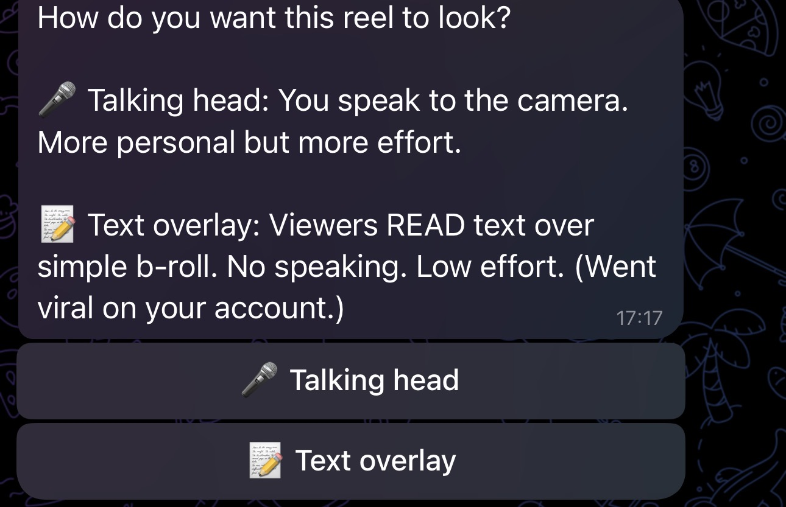

---

## 8. Turn a carousel into a reel

Already made a carousel and want the *same content* as a reel too? You don't have to
start over.

1. Make a carousel first (see [section 4](#4-make-a-carousel-post)).
2. On the carousel preview, tap **🎬 Make a reel**.
3. Choose the reel style (Talking head or Text overlay).
4. Stella re-tells your carousel as a reel script.

> **When to use which:** **🎬 Make a reel** = "I made a carousel and want the same idea
> as a reel too." **🎥 Reel ideas** = "I just want a reel, starting from scratch."

---

## 9. Build your own reel format

The bot comes with two reel styles, but you can teach it your own. This is handy when:

- You keep making reels in a particular style the built-in ones don't capture, and you
  want to reuse it, **or**
- You saw a viral reel whose structure you love and want Stella to copy that recipe for
  your own topics.

### Build a format by describing it

1. Open the menu → **💡 Get post ideas** → **🎥 Reel ideas**.
2. Tap **➕ Add format**.
3. Type a short name for it (e.g. "Story flip").
4. Describe the format: how it's structured, the tone, what happens from start to
   finish. The more specific, the better.
5. Stella builds it and shows you a sample reel in that style.
6. Tap **💾 Save format** to keep it, **🔄 Regenerate** to try again, or **🗑 Discard** to
   throw it away.

Saved formats then appear as a choice every time you make a reel.

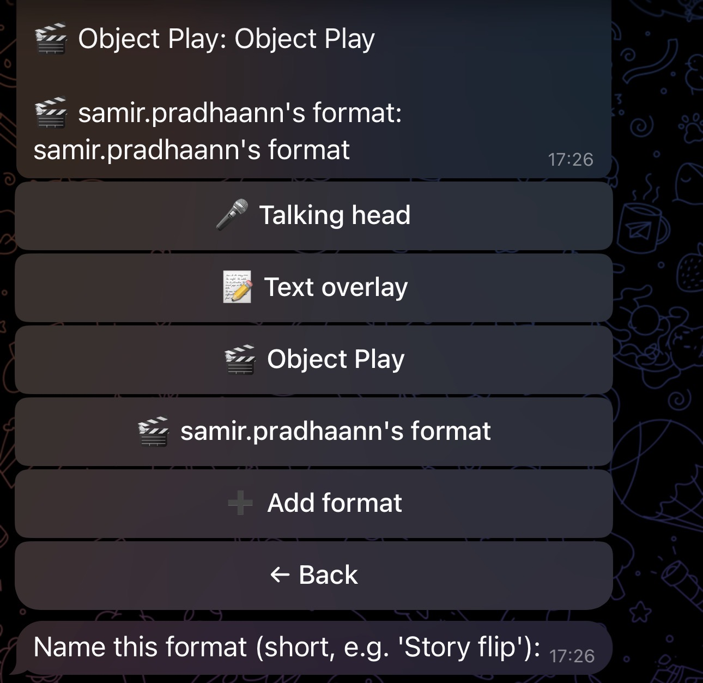

### Build a format from a viral reel

See [section 10](#10-find-trending-content-viral-posts) — when viewing a trending reel,
tap **🧬 Build format from this**, and Stella studies that reel and turns its style into
a reusable format for you.

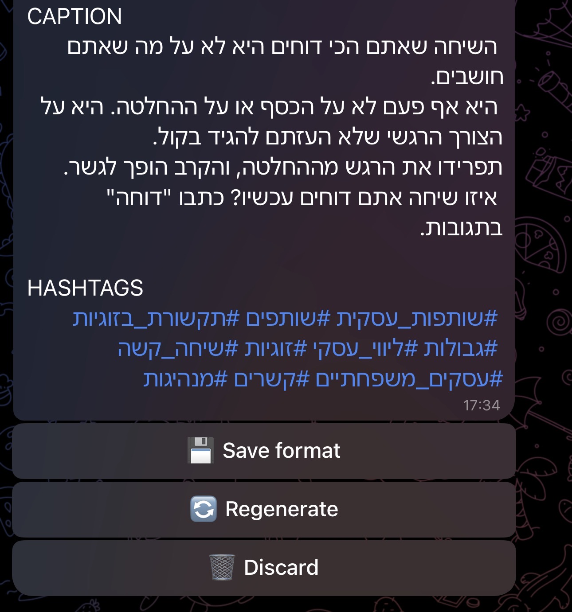

---

## 10. Find trending content (Viral posts)

This is where you go hunting for fresh ideas and trends. You give Stella keywords, and
she finds reels across Instagram that are doing well on those topics — so you can mine
them for ideas, hooks, and formats.

> **Viral posts vs. Competitors:** Use **Viral posts** when you're actively looking for a
> fresh idea or trend *right now*. Use **Competitors** (next section) to set up accounts
> you want Stella to quietly learn from over time.

### Set up keywords and get a report

1. Open the menu and tap **🔥 Viral posts**.
2. Tap **➕ Add keyword** and send a word or phrase (Hebrew or English), e.g.
   "couples in business". Add a few.
3. Tap **📊 Generate report**.
4. Stella searches and sends back compact lists of top reels per keyword.

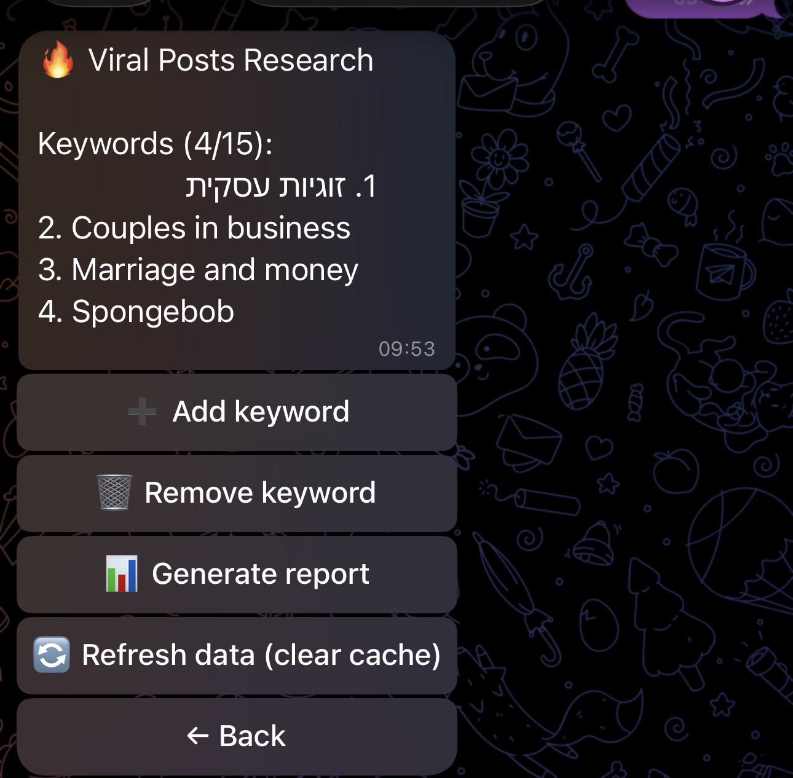

Each reel is tagged **🏆 Biggest** or **💬 Resonant**:
- **🏆 Biggest** = the giant hits, ranked by raw view count.
- **💬 Resonant** = posts people *really* engaged with for their size (lots of comments
  and shares relative to views). Often a stronger signal that the *topic* itself
  resonates, even if the view count is smaller.

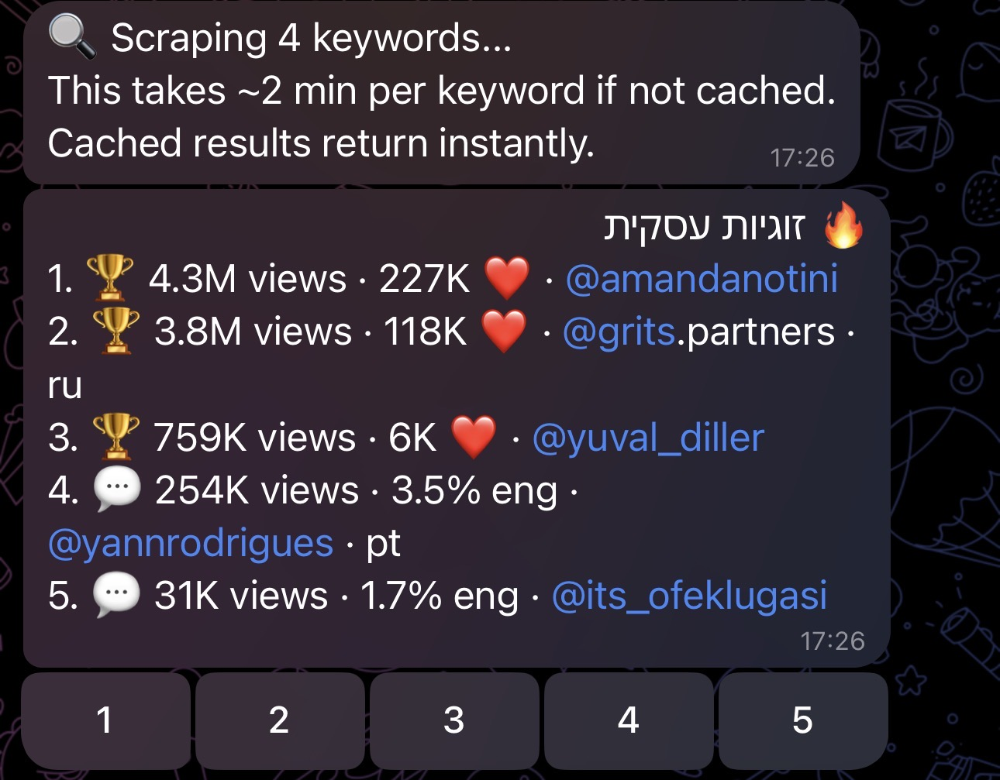

### Dig into one reel

Tap a reel's number to open its full card. From there you can:

- **➕ Add as topic** — save this reel's idea into your ideas list to make a post from
  later.
- **💡 Generate topics with AI** — Stella reads the reel and suggests several hook ideas
  adapted to *your* niche and voice. Tap a number to save one.
- **🎤 Full transcript** — read everything that's said in the reel.
- **🧬 Build format from this** — turn the reel's style into your own reusable reel
  format (see [section 9](#9-build-your-own-reel-format)).

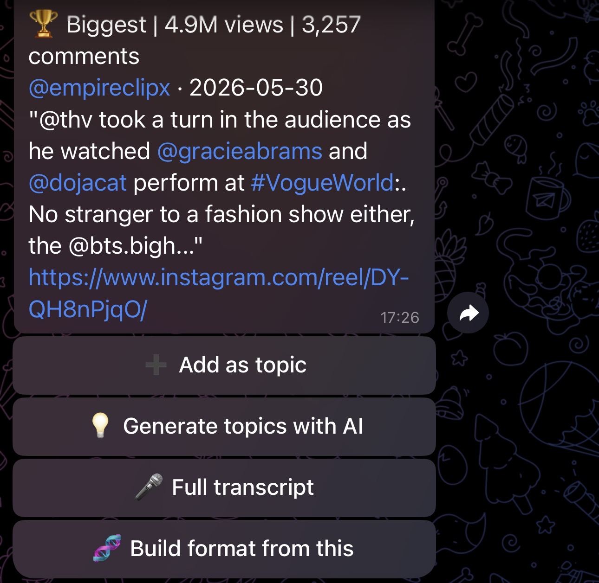

> Some reels are music-only (no talking). For those, the transcript, AI topics, and
> format options won't be available.

### Get it as a spreadsheet

Tap **📊 Get Excel** at the bottom of a report to download everything as an Excel file.

### Start fresh

Tap **🔄 Refresh data (clear cache)** to throw away old saved results so your next report
pulls brand-new reels.

---

## 11. Track competitors

Competitors are specific accounts in your niche that you want Stella to **learn from**.
Once you add them, their best-performing posts quietly shape the *style and structure*
of everything she writes for you — she borrows what's working for them (the form), but
keeps your topics and your voice (the substance).

> Set this up once with accounts you admire or compete with. It works in the background —
> you don't tap it before each post.

### Add a competitor

1. Open the menu and tap **👥 Competitors**.
2. Tap **➕ Add Competitor**.
3. Send their Instagram handle (e.g. `@nasa` or `nasa`).
4. Stella studies their account (takes about a minute) and confirms it's added.

### Remove a competitor

1. Tap **👥 Competitors**, then **➖ Remove Competitor**.
2. Tap the number of the one to remove.

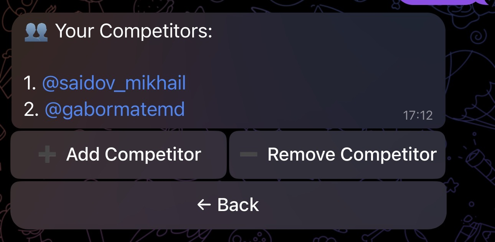

---

## 12. Change your background or logo

You can give your carousels your own look — your own background image and your own logo.

### Set a background image

1. Open the menu → **⚙️ Settings** → **🎨 Customize carousel**.
2. Tap **🖼 Background**.
3. Send a photo to use as the background.

For a clean result:
- **No text on the image** — no title, subtitle, or handle. The bot adds all the words.
- Portrait shape (tall, 4:5) works best.
- Leave a calm, simple area (top or middle) where the text can sit.

Stella saves it and shows you a quick preview slide so you can check the text looks clear.

### Set a logo

1. In **🎨 Customize carousel**, tap **🏷 Logo**.
2. Send your logo **as a file** (use the paperclip → File), **not** as a photo — sending
   it as a photo removes the transparency.
3. Use a transparent PNG, roughly square. It appears on your first and last slides.

### Refresh the current carousel with your new look

If you just changed your background or logo and want your current carousel updated to
match, tap **🔄 Re-render current carousel**. Stella re-makes the images with your new
styling (no need to write the carousel again).

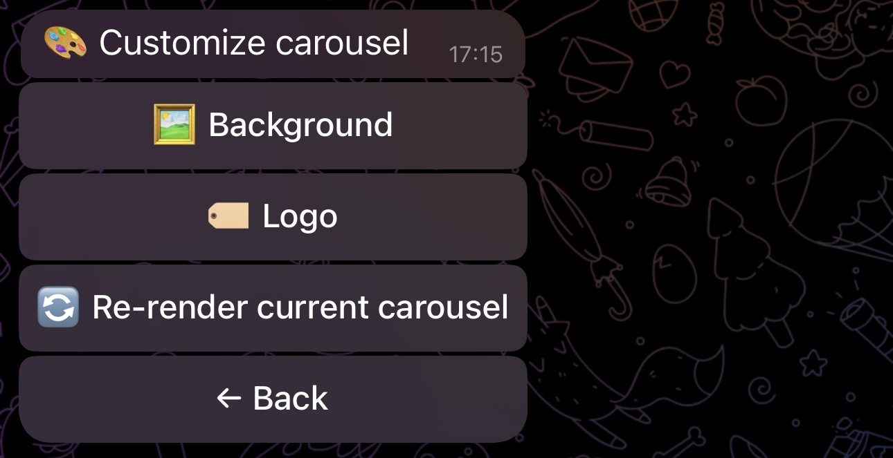

---

## 13. Get a daily idea reminder

Stella can nudge you once a day with a few post ideas to choose from, so you never sit
down to a blank page.

1. Open the menu → **⚙️ Settings** → tap the **⏰ Scheduler** button.
2. Choose when:
   - **🌅 Morning (09:00)**
   - **🌆 Evening (18:00)**
   - **🔕 Off** — no reminders.

At your chosen time, Stella sends a short **Morning Ideas** message with a few ideas from
your list. Tap any one to jump straight into making a carousel or reel from it. (Times are
Jerusalem time.)

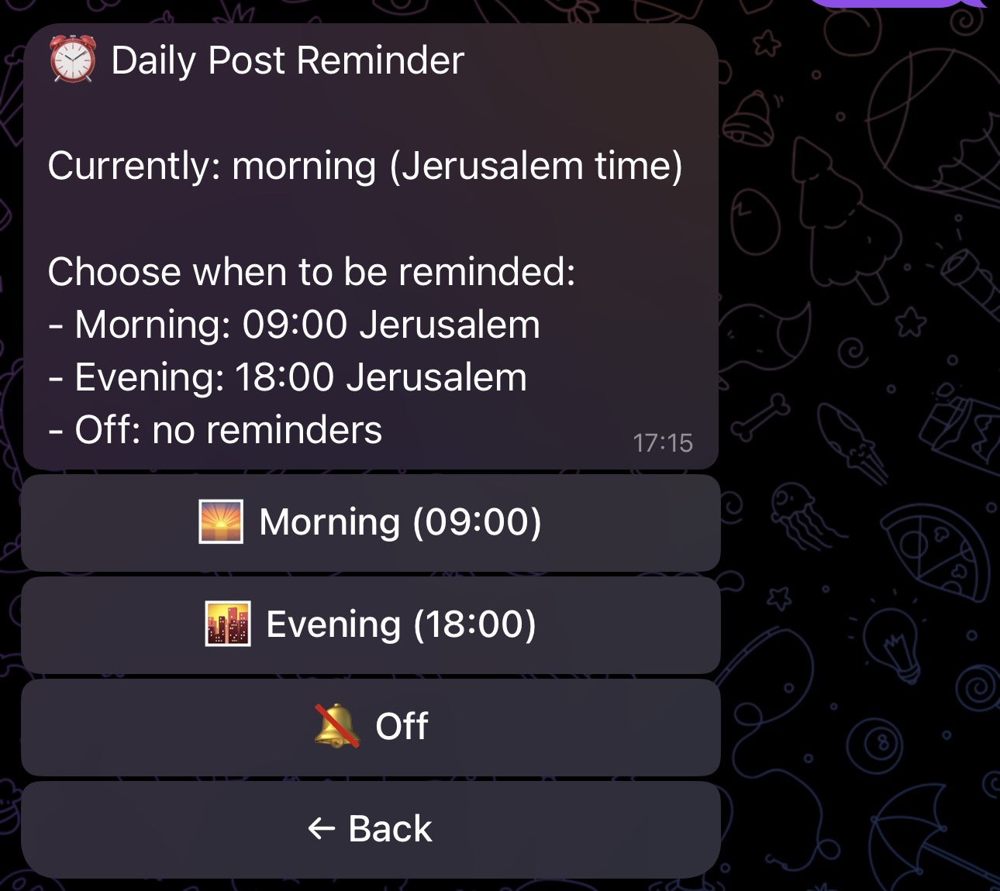

This is the daily **Morning Ideas** message you'll receive:

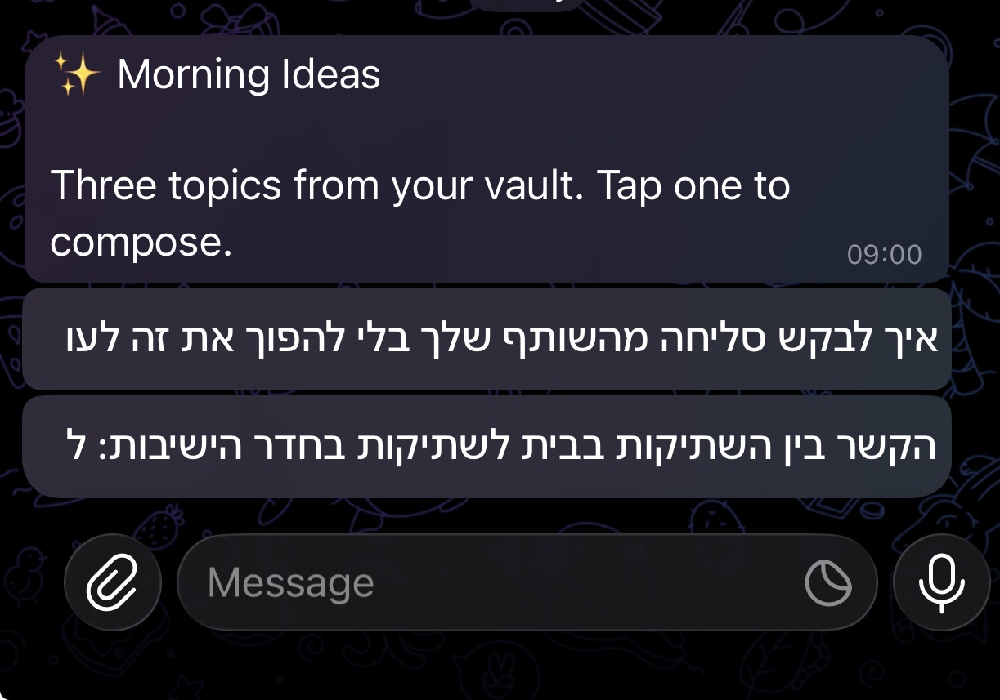

---

## 14. Connect your Instagram account

Connect Instagram once so the bot can publish carousels for you.

1. Open the menu → **⚙️ Settings**.
2. Tap **📷 Connect Instagram**.
3. Tap the button to open the Instagram authorization page.
4. Approve the app on Instagram, then come back to the chat.

Once connected, the Settings button shows **📷 Instagram (connected)**. If you ever switch
accounts, open it again and tap **🔄 Reconnect Instagram**.

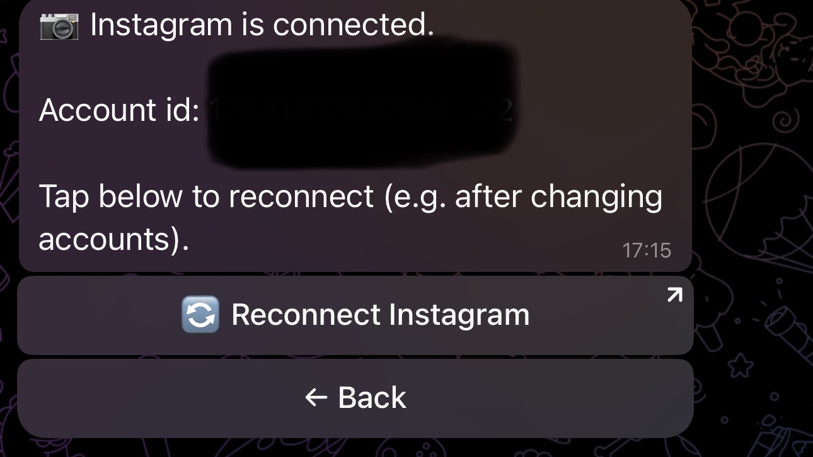

---

*That's everything! Whenever you're unsure, just type any message to bring the menu back,
and tap your way from there. Happy creating. 💜*
